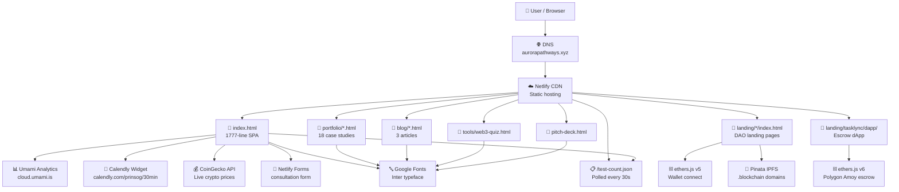

# Architecture Diagram

## Request Flow: User → Site → Integrations

## Key Integration Details

- **Netlify Forms:** Form name `consultation` with honeypot `bot-field`. POST handled by Netlify automatically.
- **Calendly:** Inline widget loaded async. URL: `https://calendly.com/prinsog/30min`.
- **CoinGecko:** Free-tier REST API. Polled every 60s. Rate limits apply.
- **Umami:** Script tag with `data-website-id` and `data-domains` constraint to `aurorapathways.xyz`.
- **ethers.js v6:** Used in Tasklync dApp for full escrow interaction on Polygon Amoy testnet.
- **ethers.js v5:** Used on blockchain subpages for MetaMask wallet connect only (no contract calls).
- **Pinata IPFS:** Landing pages deployed to `.blockchain` domains via Pinata. Dual presence with `.xyz` on Netlify.
