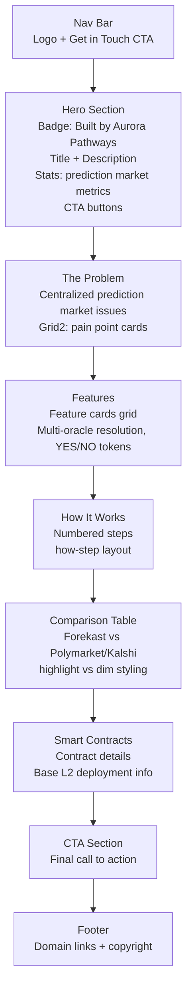

# Forekast Landing Page Map

**File:** `landing/forekast/index.html`
**URL:** `/landing/forekast/`
**Title:** Forekast — Decentralized Prediction Markets

## Section Flow

## Color Accent
- **Primary accent:** `--accent2` (#4ec9b0 teal)
- **Section label color:** teal
- **Gradient:** reversed (teal → blue → purple)

## Related Pages
- **Blockchain explorer:** `landing/forekast/blockchain/index.html`
- **Portfolio case study:** `portfolio/forekast.html`
