# index.html Section Map

Sections in order of appearance (top to bottom in DOM).

```mermaid
flowchart TD
    Loader["⏳ page-loader<br/>Full-screen overlay"]
    Cursor["✨ cursor-glow<br/>Mouse-following glow"]
    Aurora["🌌 aurora-bg<br/>Parallax background"]
    Nav["📌 navbar<br/>Fixed top nav"]
    Hero["🚀 hero<br/>Main CTA + badge"]
    Ticker["💰 ticker-bar<br/>Crypto price ticker"]
    WhyWeb3["🔐 why-web3<br/>3 value props"]
    Stats["📊 stats row<br/>Animated counters"]
    Services["🌐 services<br/>6 service cards"]
    Pricing["💳 pricing<br/>3-tier packages"]
    Timeline["📅 timeline<br/>4-step process"]
    PortfolioGrid["🎨 portfolio<br/>12 industry demos"]
    Protocols["💼 protocols<br/>4 DAO case studies"]
    CryptoPay["💵 crypto-payments<br/>Stablecoin details"]
    About["ℹ️ about<br/>Company blurb"]
    Capabilities["🏗️ capabilities<br/>What we shipped"]
    FAQ["❓ faq<br/>5 accordion items"]
    Contact["📧 contact<br/>Netlify form"]
    Calendly["📅 calendly<br/>Booking widget"]
    FindUs["🌐 find-us<br/>Domain info"]
    TrustBar["🏅 trust-bar<br/>Deployment metrics"]
    Blog["📝 blog<br/>3 article cards"]
    Footer["📎 footer<br/>Copyright"]

    Loader --> Cursor
    Cursor --> Aurora
    Aurora --> Nav
    Nav --> Hero
    Hero --> Ticker
    Ticker --> WhyWeb3
    WhyWeb3 --> Stats
    Stats --> Services
    Services --> Pricing
    Pricing --> Timeline
    Timeline --> PortfolioGrid
    PortfolioGrid --> Protocols
    Protocols --> CryptoPay
    CryptoPay --> About
    About --> Capabilities
    Capabilities --> FAQ
    FAQ --> Contact
    Contact --> Calendly
    Calendly --> FindUs
    FindUs --> TrustBar
    TrustBar --> Blog
    Blog --> Footer
```

## Section Details

| # | Section | ID/Class | Line | Background |
|---|---|---|---|---|
| 1 | Page Loader | `.page-loader` | 824 | Fixed overlay |
| 2 | Cursor Glow | `#cursorGlow` | 827 | Fixed, z-9999 |
| 3 | Aurora BG | `#auroraBg` | 830 | Fixed, z-0 |
| 4 | Navbar | `#navbar` | 837 | Fixed, backdrop-blur |
| 5 | Hero | `.hero` | 854 | Default (transparent) |
| 6 | Crypto Ticker | `.ticker-bar` | 872 | `var(--surface)` |
| 7 | Why Web3 | `#why-web3` | 890 | Default |
| 8 | Stats | `.ticker-bar` | 927 | `var(--surface)` |
| 9 | Services | `#services` | 953 | Default |
| 10 | Pricing | `#pricing` | 1028 | `.bg-surface` |
| 11 | Timeline | `#timeline` | 1101 | Default |
| 12 | Portfolio | `#portfolio` | 1137 | `.bg-surface` |
| 13 | Crypto Payments | `#crypto-payments` | 1329 | Default |
| 14 | About | `#about` | 1381 | `.bg-surface` |
| 15 | Capabilities | `#capabilities` | 1398 | Default |
| 16 | FAQ | `#faq` | 1443 | `.bg-surface` |
| 17 | Contact | `#contact` | 1477 | Default |
| 18 | Calendly | *(no ID)* | 1520 | `var(--surface)` |
| 19 | Find Us | *(no ID)* | 1535 | `var(--surface)` |
| 20 | Trust Bar | `.trust-bar` | 1556 | `var(--surface)` |
| 21 | Blog | `#blog` | 1582 | Default |
| 22 | Footer | `<footer>` | 1626 | Default + border-top |

## Nav Links (anchor targets)

- Services → `#services`
- Portfolio → `#portfolio`
- Pricing → `#pricing`
- Crypto Pay → `#crypto-payments`
- Process → `#timeline`
- FAQ → `#faq`
- Pitch Deck → `/pitch-deck.html` (new tab)
- Get Started → smooth-scrolls to `#contact`
