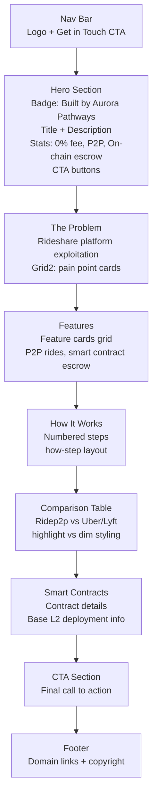

# Ridep2p Landing Page Map

**File:** `landing/ridep2p/index.html`
**URL:** `/landing/ridep2p/`
**Title:** Ridep2p — Decentralized Ride Protocol

## Section Flow

## Color Accent
- **Primary accent:** `--accent3` (#e8a840 gold)
- **Section label color:** gold
- **Gradient:** gold → pink → purple

## Related Pages
- **Blockchain explorer:** `landing/ridep2p/blockchain/index.html`
- **Portfolio case study:** `portfolio/ridep2p.html`
