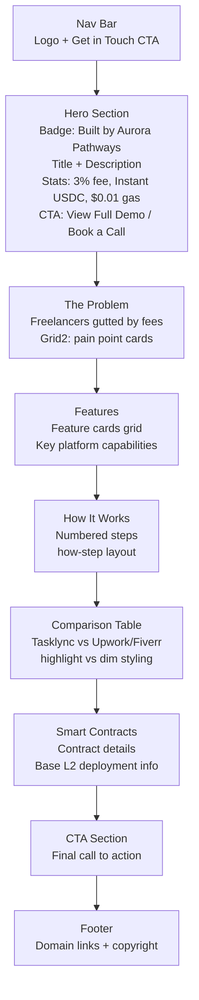

# Tasklync Landing Page Map

**File:** `landing/tasklync/index.html`
**URL:** `/landing/tasklync/`
**Title:** Tasklync — Permissionless Freelance Marketplace

## Section Flow

## Color Accent
- **Primary accent:** `--accent` (#7c5cfc purple)
- **Section label color:** purple
- **Stat values:** `--accent2` (#4ec9b0 teal)

## Related Pages
- **Blockchain explorer:** `landing/tasklync/blockchain/index.html`
- **dApp:** `landing/tasklync/dapp/index.html`
- **Portfolio case study:** `portfolio/tasklync.html`
